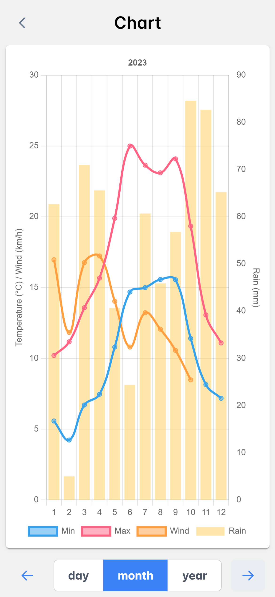

# ThermoStats - Weather Dashboard Project

ThermoStats is a weather tracking Progressive Web Application (PWA) built with Angular. It allows users to track and visualize weather data, such as temperature, rainfall, and wind speed. This application provides three main pages:

- **Dashboard**: A graphical summary of the weekly weather data.
- **Add Page**: A form for adding weather data including date, min/max temperature, rainfall, and wind speed.
- **Chart Page**: A detailed chart where users can choose to view data by day, month, or year.

This project also includes a **Docker configuration**, allowing it to be easily built and deployed in a containerized environment.

## Features

### 1. Dashboard
The Dashboard page displays:
- A summary graph of the weather data over the past week.
- Quick statistics such as max/min temperatures, total rainfall, and wind speed.


### 2. Add Page
The Add Data page allows users to input weather data:
- **Date**: Date of the weather record.
- **Max Temperature**: Maximum temperature recorded.
- **Min Temperature**: Minimum temperature recorded.
- **Rain**: Rainfall amount in millimeters (mm).
- **Wind**: Wind speed in kilometers per hour (km/h).


### 3. Chart Page
The Chart page allows users to select how they want to visualize the data:
- **Daily**: View individual days' data.
- **Monthly Average**: View averaged data per month.
- **Yearly Average**: View averaged data per year.



### 4. Progressive Web Application (PWA)
ThermoStats is built as a PWA intended for mobile devices, meaning it can:
- Be installed on mobile devices.
- Provide an app-like experience with fast loading and smooth interactions.

## Setup Instructions

### Prerequisites
- **Node.js** and **npm** should be installed.
- **Angular CLI** should be installed globally:
  ```bash
  npm install -g @angular/cli
  ```
### Installation
1. Clone the repository:

```bash
git clone https://github.com/LeoLsrd1/ThermoStats.git
cd ThermoStats
```
2. Install the project dependencies:

```bash
npm install
```
3. Create and navigate to the src/environments folder and create the environment.ts file.

### Environment Configuration
You need to set the apiUrl in the src/environments/environment.ts file, which points to your backend server API for weather data retrieval and submission.

Example:

```typescript
export const environment = {
production: false,
apiUrl: 'http://your-backend-server-url/api/data'  // Replace with your server API
};
```
This apiUrl must connect to a server that provides the following API endpoints:

* GET /api/data - Retrieve all weather data.
* GET /api/data/last7days - Retrieve data from the last 7 days.
* GET /api/data/lastMonth - Retrieve data from the last month.
* GET /api/data/lastYear - Retrieve data from the last year.
* GET /api/data/date/:selectedDate - Retrieve weather data for a specific date.
* GET /api/data/year/:year - Retrieve weather data for a specific year.
* POST /api/data - Add or update weather data.

### Docker Setup
ThermoStats is configured to be built and run using Docker. Here’s how to build and run the project using Docker:

1. Build the Docker Image: Make sure you have Docker installed on your machine. In the root of the project directory, you can build the Docker image by running:

```bash
docker build -t thermostats-app .
```
2. Run the Docker Container: Once the image is built, you can run the application in a Docker container using the following command:

```bash
docker run -p 8000:80 thermostats-app
```
3. Access the Application: After running the container, you can access the ThermoStats application by navigating to http://localhost:8000 in your browser.

### Running Locally without Docker
To run the Angular application locally, follow these steps:

1. Start the Angular development server:

```bash
npm run start
```
2. Navigate to http://localhost:4300 in your browser to view the application.

### Progressive Web App (PWA) Features

ThermoStats is a Progressive Web Application, so you can install it on your mobile device:  
Visit the website, and you'll need to manually add the app to your home screen. On iPhone, open the app in Safari, tap the "Share" button, and then select "Add to Home Screen".

### Backend API Example (Node.js/Express)
For development and testing, you can use the following example for your backend server. Ensure that you have a MySQL or MariaDB database set up with the correct schema.

```javascript
const express = require('express');
const cors = require('cors');
const mysql = require('mysql');

const app = express();
app.use(cors());
app.use(express.json());

const db = mysql.createConnection({
host: 'localhost',
user: 'yourUsername',
password: 'yourPassword',
database: 'ThermoStats'
});

db.connect(err => {
if (err) throw err;
console.log('Connected to the database');
});

app.get('/api/data', (req, res) => {
const sql = 'SELECT * FROM ThermoStatsDB';
db.query(sql, (err, results) => {
if (err) throw err;
res.json(results);
});
});

app.post('/api/data', (req, res) => {
const { date, maxTemp, minTemp, rain, wind } = req.body;

    if (!date || maxTemp == null || minTemp == null || rain == null || wind == null) {
        return res.status(400).json({ message: 'Missing data' });
    }

    const sql = `
        INSERT INTO ThermoStatsDB (date, maxTemp, minTemp, rain, wind)
        VALUES (?, ?, ?, ?, ?)
        ON DUPLICATE KEY UPDATE 
        maxTemp = VALUES(maxTemp), 
        minTemp = VALUES(minTemp),
        rain = VALUES(rain),
        wind = VALUES(wind)
    `;

    db.query(sql, [date, maxTemp, minTemp, rain, wind], (err, result) => {
        if (err) throw err;
        res.json({ message: 'Data successfully added or updated' });
    });
});

app.listen(3000, () => {
console.log('Server running on port 3000');
});
```

## Additional Information
* Backend Server: Ensure the backend server for weather data is running.
* API Configuration: Set the correct apiUrl in the environment.ts file to connect to your backend.
* PWA: After building for production (npm run build --prod), the app can be installed on any device.
* Docker: Use Docker for easy deployment of the application.
